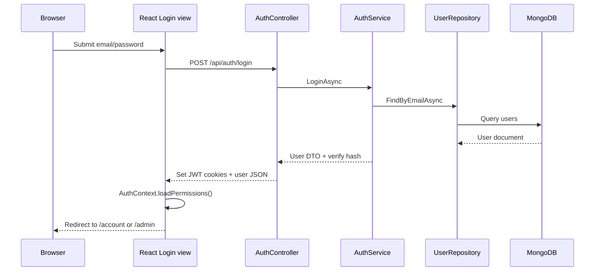

# Data Flow Examples

Concrete request paths through the system. Use these when debugging or tracing a feature end-to-end.

## 1. User login



**Frontend files:** `views/Login.tsx`, `contexts/AuthContext.tsx`, `DataRepository/AuthDao.ts`

## 2. Browse product catalog (public)

1. User opens `/products`
2. `Products.tsx` calls `GET /api/products?category=&sort=`
3. `ProductsController` → `ProductService.ListAsync` → `ProductRepository`
4. JSON list rendered in grid; no auth required

**Module ID:** `/products` (public READ)

## 3. Checkout and place order

1. User must be logged in (`ProtectedRoute` on `/checkout`)
2. Cart items from `CartContext` (client state)
3. `POST /api/orders` with line items, address, coupon code
4. `OrderService.CreateAsync`:
   - Validates stock/coupon
   - Creates order doc with prefix `NJ-`
   - Updates product stock
   - Writes activity log
5. Response → order confirmation / redirect to `/account/orders`

**Module ID:** `/checkout` (CREATE)

## 4. Admin update order status

1. Staff opens `/admin/orders/:id`
2. `PATCH /api/admin/orders/{id}/status` with `{ status: "shipped" }`
3. `[AdminAuthorize]` on controller
4. `OrderService.AdminUpdateStatusAsync` pushes timeline entry
5. UI refreshes order detail

**Module ID:** `/admin/orders` (UPDATE)

## 5. Load permissions after login

1. `AuthContext` calls `RbacDao.getMyPermissions()`
2. `GET /api/users/permissions/me` with `[UserAuthorize]`
3. `PermissionService.LoadEffectivePermissionsAsync`:
   - Load role permissions if `role_id` set
   - Else infer from `role` slug (staff/customer)
   - Merge user overrides
4. Response cached in localStorage; `hasPermission()` reads cache

## 6. Admin saves role permissions

1. Admin opens `/admin/permissions` → Roles tab
2. Select role, toggle matrix checkboxes
3. `PUT /api/roles/{roleId}/permissions` body:
   ```json
   { "permissions": [{ "module_id": "/admin/products", "permission_bits": 15 }] }
   ```
4. `PermissionService.UpdateRolePermissionsAsync` upserts `role_permissions`
5. Cache invalidated for all users with that role
6. `POST /api/reloadPermissions` clears global cache

## 7. Media upload

1. Admin opens `/admin/media`, selects file
2. `POST /api/admin/media/upload` (multipart)
3. `MediaService.UploadAsync` stores binary in MongoDB `media` collection
4. Returns `{ id, url }` where url is `/api/admin/media/{id}`
5. Product/blog forms reference media URL

## Error handling pattern

| Layer | Behavior |
|-------|----------|
| API | `{ detail: "message" }` or validation array |
| xhr | `apiError()` extracts message for toast |
| UI | `sonner` toast for user feedback |

## JSON naming

All API JSON uses **snake_case** (`created_at`, `role_id`, `permission_bits`). TypeScript types may use the same or map in DAO unwrap helpers.
