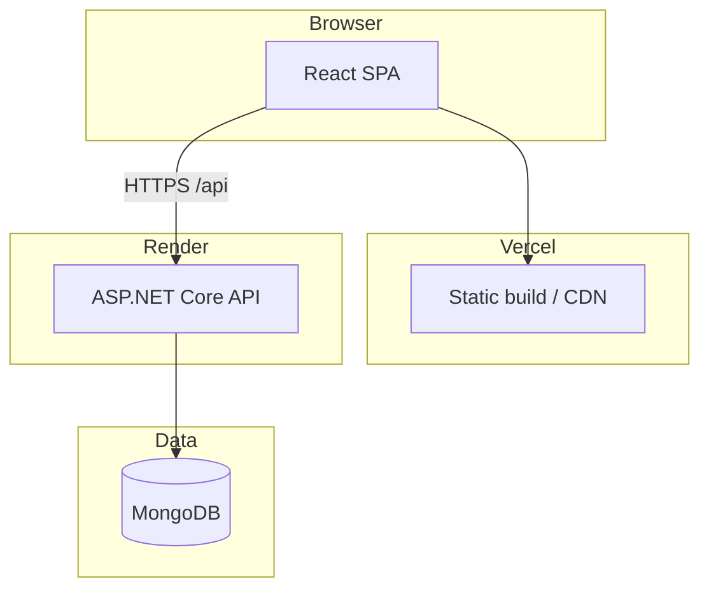

# Architecture Overview

New Journey Store is a **monorepo-style** application: a React SPA talks to an ASP.NET Core Web API, which persists data in MongoDB. The design follows the **CloudPathology (CP) layered pattern** — strict separation between HTTP, business logic, and data access, with a bitmask RBAC system shared across backend and frontend.

## System diagram



## Major domains

| Domain | Users | Entry routes |
|--------|-------|--------------|
| **Storefront** | Public | `/`, `/products`, `/blog`, `/cart` |
| **Customer account** | Logged-in customers | `/account/*`, `/checkout` |
| **Admin (Studio OS)** | Admin / staff | `/admin/*` |
| **Auth** | All | `/login`, `/register`, `/api/auth/*` |
| **RBAC** | Admin | `/admin/permissions`, `/api/roles/*` |

## Repository structure

```
app/
├── backend/
│   ├── PrintForge.Api/           # HTTP entry, controllers, Program.cs
│   ├── PrintForge.Services/      # Business logic
│   ├── PrintForge.Repositories/  # MongoDB access
│   ├── PrintForge.Models/        # Entities + DTOs
│   ├── PrintForge.Constants/     # Modules, permissions, app constants
│   └── PrintForge.Infrastructure/# Auth, DB context, middleware, DI
├── frontend/src/
│   ├── views/                    # Page components (routes)
│   ├── components/               # Reusable UI + CLAuth
│   ├── common_assets/            # DAOs, constants, xhr client
│   ├── contexts/                 # Auth, Cart, Theme
│   └── types/                    # TypeScript interfaces
└── packages/constants/
    └── modules.json              # Shared module registry
```

> **Note:** Internal .NET namespaces still use `PrintForge.*`. User-facing branding is **New Journey (NJ)**.

## Request lifecycle

1. Browser loads React app from Vercel (or `npm start` locally).
2. User action triggers an API call via `xhr` (axios) to `{REACT_APP_BACKEND_URL}/api/...`.
3. Request includes cookies (JWT access/refresh), optional `moduleID` and `l_id` headers.
4. ASP.NET pipeline: **CORS → Authentication → Authorization → ContextMiddleware → PermissionMiddleware → Controller**.
5. Controller validates input, calls **Service**, which uses **Repository** for MongoDB.
6. JSON response (snake_case) returns to frontend; UI updates via React state/context.

## Authentication model

- **JWT** stored in **HttpOnly cookies** (`access_token`, `refresh_token`).
- `[UserAuthorize]` — any authenticated user.
- `[AdminAuthorize]` — user with `role` of `admin` or `staff` (legacy admin bypass for full CRUD).
- Fine-grained access uses **module_id + permission bits** (see [RBAC doc](rbac-and-security.md)).

## Key design decisions

| Decision | Rationale |
|----------|-----------|
| MongoDB | Flexible catalog/order documents; fast iteration for studio inventory |
| Cookie-based JWT | SPA security without storing tokens in localStorage |
| Bitmask permissions | Compact CRUD+HIDDEN flags; same model on client and server |
| module_id = route path | Easy mapping between UI routes and API permission checks |
| Seed on startup | Demo data for interns and staging without manual DB setup |

## Deployment topology

| Component | Platform | Notes |
|-----------|----------|-------|
| Frontend | Vercel | CRA build, SPA rewrites to `index.html` |
| Backend | Render | `dotnet run`, env vars for Mongo + JWT |
| Database | MongoDB Atlas or self-hosted | Connection string in `MongoUrl` |

See [Deployment](../tech/deployment.md) for step-by-step production setup.

## Further reading

- [Backend layers](backend-layers.md)
- [Frontend structure](frontend-structure.md)
- [Data flow examples](data-flow.md)
- [RBAC & security](rbac-and-security.md)
