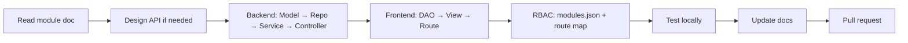

# Development Workflow

Standard process for implementing features and fixes on New Journey Store.

## Branching

| Branch | Purpose |
|--------|---------|
| `main` | Production-ready |
| `feature/<name>` | New features |
| `fix/<name>` | Bug fixes |

Ask your lead for team-specific PR rules. Do not force-push to `main`.

## Implementation flow



## Backend change checklist

1. **Models** — entity and/or DTO in `PrintForge.Models`
2. **Repository** — interface + MongoDB methods
3. **Service** — business logic; inject repo interfaces
4. **Controller** — thin action; correct `[UserAuthorize]` / `[AdminAuthorize]`
5. **DI** — register new services in `AddPrintForgeServices` if needed
6. **Build** — `dotnet build PrintForge.Api/PrintForge.Api.csproj`

## Frontend change checklist

1. **Types** — add interfaces in `types/index.ts` if new shapes
2. **DAO** — add methods in appropriate `*Dao.ts` or use `lib/api.ts` for simple admin pages
3. **View** — page component under `views/`
4. **Route** — lazy import in `App.tsx`
5. **Nav** — `AdminLayout.tsx` link if admin page
6. **Permissions** — `AppPermissionRoutes.tsx` + UI gates
7. **Build** — `npm run build` (or `build:strict` before release)

## Adding a new admin module (full)

1. Add to `packages/constants/modules.json`
2. Sync `PrintForge.Constants/Modules.cs`
3. Sync `frontend/src/common_assets/Constants/modules.ts`
4. RBAC seed picks up new modules on restart (or manual seed)
5. Backend controller with `[AdminAuthorize]`
6. Frontend view + route + sidebar
7. `docs/modules/admin-<name>.md`
8. Update `docs/api/rest-api-reference.md`

## Testing locally

| Area | How to verify |
|------|----------------|
| API | Browser or curl → `/api/health`; DevTools Network on UI actions |
| Auth | Login/logout; `/auth/me` returns user |
| Admin | All sidebar links load without 403 |
| Permissions | Toggle role in `/admin/permissions`; verify UI hides/shows |
| Checkout | Customer flow end-to-end with demo account |

Automated tests: legacy Python tests were removed; .NET integration tests are a future addition. Manual QA is required for now.

## Debugging tips

| Problem | Check |
|---------|-------|
| CORS | `CorsOrigins` includes frontend URL |
| 401 everywhere | Cookies blocked? `REACT_APP_BACKEND_URL` correct? |
| Empty data | Mongo running? Seed completed? Wrong `DbName`? |
| Permission denied | User role; module_id header; role matrix in admin |
| TS build fails | `npm run build:strict` for full errors |

## Documentation duty

Any PR that changes behavior must update:

- Relevant `docs/modules/*.md`
- API reference if endpoints changed
- README only if run instructions changed

## Commit messages

Use clear, imperative sentences:

```
Add low-stock badge to admin inventory table
Fix coupon validation for zero subtotal
Document permissions API in rest-api-reference
```

## Pre-PR self review

- [ ] No secrets in diff
- [ ] No debug `console.log` left in
- [ ] Builds pass (backend + frontend)
- [ ] Tested happy path in browser
- [ ] Docs updated if needed

## Deployment

Merging to `main` may auto-deploy Vercel/Render if connected. Coordinate with team before merging breaking API changes — frontend and backend deploy independently.

See [Deployment](../tech/deployment.md).
